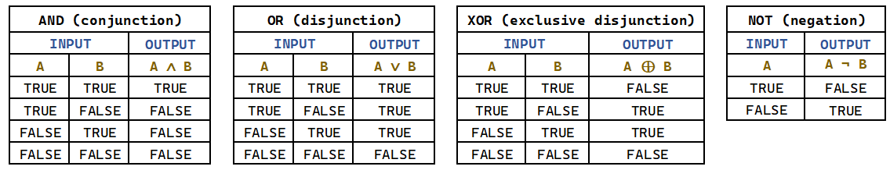

**Three basic boolean operators**
1 AND 2: Results that contain both 1 and 2
1 OR 2: Results that contain either 1, or 2, or both 1 and 2
1 NOT 2: Results that contain 1 but not 2

Boolean operators can be chained together as demonstrated below.
`1 AND (2 OR 3)` - Returns true if 1 is true and either 2 or 3 or both are also true.

*EXAMPLE: Truth Tables for AND, OR, XOR and NOT:*

The symbol for the:
- NOT operator is `¬`
- AND operator is `∧`
- OR operator is `∨`